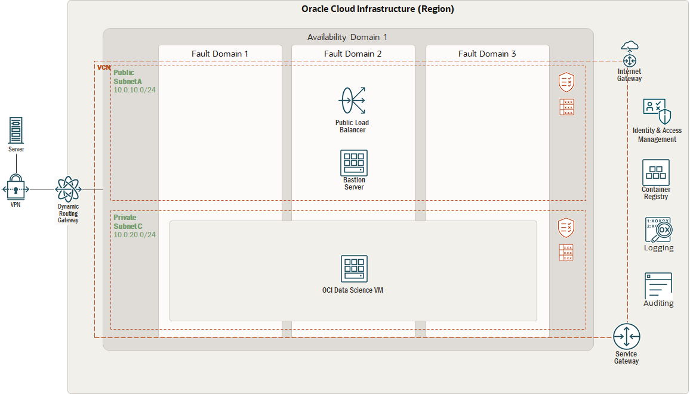

# Deployment Path: DIY

## How It Works

## Let's build it

**Use Case: Leverage Marketplace Data Science VM for Machine Learning**

* a. Model Development (DEVELOP)
    Create and configure a virtual cloud network
    Create Open source Data Science compute instance from Marketplace
    Launch Cloud Shell connection / Connect to a Cloud VM on Windows with PuTTY
    Activate AI/ML/DL environment
    Develop & Store ML Model using Jupyter notebook

* b. Model Deployment (DEPLOY)
    Create Model deployment using python Flask

Using Oracle Resource Manager (ORM)

This solution allows you to provision Oracle Data Science Market place VM and all its related artifacts using Terraform and Oracle Cloud Infrastructure Resource Manager.

[]

1. clone repo git clone git@orahub.oci.oraclecorp.com:apac-oci-ohana/ohana-aiml.git

2. Download 1a_diy.zip file

3. From Oracle Cloud Infrastructure Console/Resource Manager, create a new stack.

4. Make sure you select My Configurations and then upload the zip file downloaded in the previous step.

5. Set a name for the stack and click Next.

6. Set the required variables values and then Create.

7. From the stack details page, Select Plan under Terraform Actions menu button and make sure it completes successfully.

8. From the stack details page, Select Apply under Terraform Actions menu button and make sure it completes successfully.

9. To destroy all created artifacts, from the stack details page, Select Destroy under Terraform Actions menu button and make sure it completes successfully.

10. Data Science Virtual Machine status shows running

    

11. Launch Cloud Shell connection

    

12. Connect to a Cloud VM on Windows with PuTTY

    

13. Activate AI/ML/DL environment

The sandbox environment "mlenv' is already created and configured with 110 ML libraries and frameworks. This environment should be activated for the AI/ML/DL developer user by running the following commands:
    $source mlenv/bin/activate

Next you should reset the password for the Jupyter Notebook (read and Write access over the network):

    [mlenv]$jupyter notebook password

This command can be used to reset the password too.

You need to start the Jupyter Server by running

    [mlenv]$jupyter notebook --ip=0.0.0.0 --port=8080

The Jupyter environment can accessed through web - https://public-ip:8080

NOTE: Please make sure your security list and network security group (if used) are configured to allow inbound port 8080.

Jupyter environment can accessed through web - https://public-ip:8080

NOTE: Please make sure your security list and network security group (if used) are configured to allow inbound port 8080.To list the AI Data Science packages included in the image, please run the command:
    [mlenv]$pip3 list
    Following hands-on labs  are available in the Example directory under /home/opc:
    - Examples/deeplearning_bootcamp-master/lab1
    - Examples/deeplearning_bootcamp-master/lab2
    - Examples/deeplearning_bootcamp-master/lab3
    - Examples/deeplearning_bootcamp-master/lab4

14. Develop & Store ML Model in GitHub using Jupyter notebook

 Upload project using git commands:
 First create a new repository in GitHub. And use the below commands in command prompt:
    !git init
    !git add README.md  
    !git add MLOps_project.ipynb
    !git commit -m "notebook first commit" 
    !git remote add origin https://github.com/{repo name}/repository_name.git 
    !git push -u origin master 

### b. Model Deployment (DEPLOY)
    Create Model deployment using python Flask
        # Import the python file containing the ML model
        import model
        # Import flask libraries
        from flask import Flask, request, render_template 
        # Define Prediction function using FlasK API
        app = Flask(__name__,template_folder="templates")

        # Default route set as 'home'
        @app.route('/home')
        def home():
            return render_template('home.html')  
        
        # Route 'classify' accepts GET request
        @app.route('/classify',methods=['GET'])
        def classify_type():
                    try:
                        Age = request.args.get('Age') # Get parameters for Age
                        Gender = request.args.get('Gender') # Get parameters for Gender
                        Marital_Status = request.args.get('Marital_Status') # Get parameters for Marital_Status
                        Family_Size = request.args.get('Family_Size') # Get parameters for Family_Size
                        Education_Level = request.args.get('Education_Level') # Get parameters for Education_Level
                        Income = request.args.get('Income') # Get parameters for Income
                        Occupation = request.args.get('Occupation') # Get parameters for Occupation
                        Present_employment_since = request.args.get('Present_employment_since') # Get parameters for Present_employment_since
                        Loan_Amount = request.args.get('Loan_Amount') # Get parameters for Loan_Amount
    #Import Store Model file
    #load Final model
    Final_model = joblib.load("final_model.pkl","rb")
    
    #predict
    prediction = Final_model.predict(Age, Gender, Marital_Status, Family_Size, Education_Level, Income, Occupation, Present_employment_since, Loan_Amount)
    # Render the output in new HTML page
            return render_template('output.html', prediction=prediction)
        except:
            return 'Error'

    # Run the Flask server
    if(__name__=='__main__'):
            app.run(debug=True)

## Resources

- https://docs.oracle.com/en/solutions/data-science-oci/index.html#GUID-D074DA15-97C3-486D-A479-3A9EF74C07EE 
- https://blogs.oracle.com/cloud-infrastructure/post/announcing-the-availability-of-vm-for-data-science-and-ai-on-oracle-cloud-infrastructure 
- https://cloudmarketplace.oracle.com/marketplace/en_US/listing/78643201
- https://apexapps.oracle.com/pls/apex/dbpm/r/livelabs/workshop-attendee-2?p210_workshop_id=648&p210_type=3&session=113356609506824 
- https://www.oracle.com/webfolder/technetwork/tutorials/obe/cloud/ggcs/Connect_to_a_cloud_VM_on_Windows_with_Putty/connect_to_a_cloud_VM_using_Putty.html

For example

[LiveLabs](https://apexapps.oracle.com/pls/apex/dbpm/r/livelabs/view-workshop?wid=651&clear=180&session=3650076810239)

[Refernce Architecture](https://docs.oracle.com/en/solutions/ha-web-app/index.html)

[MAD Framwork](https://docs.oracle.com/en/solutions/mad-web-mobile/index.html)

## License

`License info here`