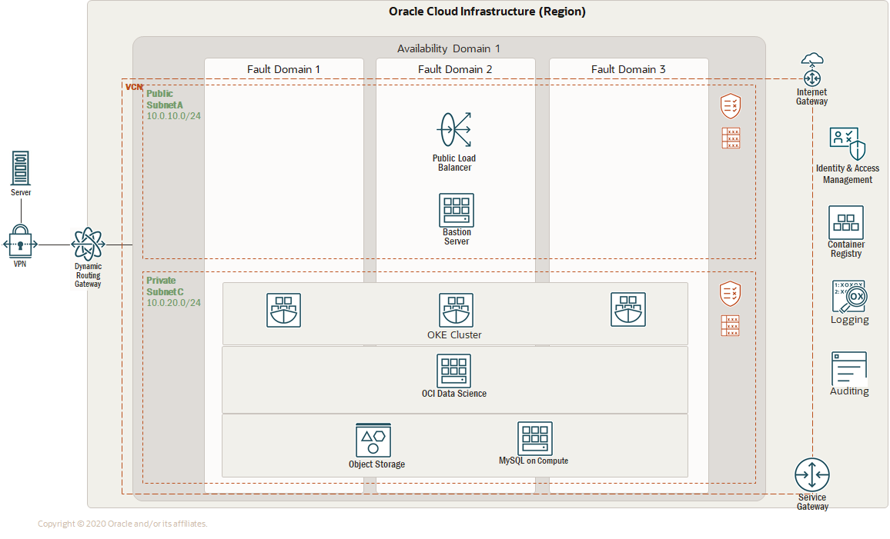

# Deployment Path: Mix and Match with CICD

## How It Works

## Let's build it

**Use Case – Leveraging OCI Data Science for Machine Learning**

* a. Model Development (DEVELOP)**
    * Create and configure a virtual cloud network**
    * Setup OCI Lakehouse
    * Setup OCI Data Catalog for Data Identification
    * Setup Oracle Autonomous DatabaseSetup 
    * Setup OCI Data Science for Model Development
    * Store ML Model in model catalog using OCI Data Science notebook 
    * Deploy Model and generate Endpoint

* b. Model Operations (RUN)**
    * Create Oracle Analytics cloud environment for model monitoring

Using Oracle Resource Manager (ORM)

This solution allows you to provision Oracle Data Science and all its related artifacts using Terraform and Oracle Cloud Infrastructure Resource Manager.

[]

1. clone repo git clone git@orahub.oci.oraclecorp.com:apac-oci-ohana/ohana-aiml.git

2. Download 2b_mixmatch_cicd.zip file

3. From Oracle Cloud Infrastructure Console/Resource Manager, create a new stack.

4. Make sure you select My Configurations and then upload the zip file downloaded in the previous step.

5. Set a name for the stack and click Next.

6. Set the required variables values and then Create.

7. From the stack details page, Select Plan under Terraform Actions menu button and make sure it completes successfully.

8. From the stack details page, Select Apply under Terraform Actions menu button and make sure it completes successfully.

9. To destroy all created artifacts, from the stack details page, Select Destroy under Terraform Actions menu button and make sure it completes successfully.

## Resources

  https://docs.oracle.com/en/learn/lab_virtual_network/index.html#create-your-vcn

  https://docs.oracle.com/en-us/iaas/data-catalog/using/create-instance.htm

  https://docs.oracle.com/en/solutions/data-science-environment/index.html#GUID-299560C7-DFC0-4D02-9C46-5771D52FBD11

  https://docs.oracle.com/en-us/iaas/data-science/data-science-tutorial/tutorial/get-started.htm

For example

[LiveLabs](https://apexapps.oracle.com/pls/apex/dbpm/r/livelabs/view-workshop?wid=651&clear=180&session=3650076810239)

[Refernce Architecture](https://docs.oracle.com/en/solutions/ha-web-app/index.html)

[MAD Framwork](https://docs.oracle.com/en/solutions/mad-web-mobile/index.html)

## License

`License info here`

For example

[LiveLabs](https://apexapps.oracle.com/pls/apex/dbpm/r/livelabs/view-workshop?wid=651&clear=180&session=3650076810239)

[Refernce Architecture](https://docs.oracle.com/en/solutions/ha-web-app/index.html)

[MAD Framwork](https://docs.oracle.com/en/solutions/mad-web-mobile/index.html)

## License

`License info here`

For example

[LiveLabs](https://apexapps.oracle.com/pls/apex/dbpm/r/livelabs/view-workshop?wid=651&clear=180&session=3650076810239)

[Refernce Architecture](https://docs.oracle.com/en/solutions/ha-web-app/index.html)

[MAD Framwork](https://docs.oracle.com/en/solutions/mad-web-mobile/index.html)

## License

`License info here`
