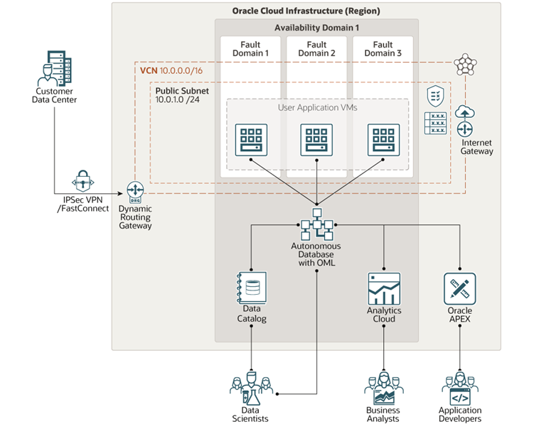

# Deployment Path: Managed

## How It Works

## Let's build it

### MLOps
# Model Development (DEVELOP)
    * Create and configure a virtual cloud network
    * Data Identification using OCI Data Catalog
    * Oracle Machine Learning Notebooks and connection to an Oracle Autonomous Database from a Python session
# Model Deployment (DEPLOY)
    * Implement ML Model in production environment  
# Model Operations (RUN)
    * ML Model Monitor Model , Model Drift , Data Drift

Using Oracle Resource Manager (ORM)

This solution allows you to provision Oracle Data Science and all its related artifacts using Terraform and Oracle Cloud Infrastructure Resource Manager.

[]

1. clone repo git clone git@orahub.oci.oraclecorp.com:apac-oci-ohana/ohana-aiml.git

2. Download 3a_managed.zip file

3. From Oracle Cloud Infrastructure Console/Resource Manager, create a new stack.

4. Make sure you select My Configurations and then upload the zip file downloaded in the previous step.

5. Set a name for the stack and click Next.

6. Set the required variables values and then Create.

7. From the stack details page, Select Plan under Terraform Actions menu button and make sure it completes successfully.

8. From the stack details page, Select Apply under Terraform Actions menu button and make sure it completes successfully.

9. To destroy all created artifacts, from the stack details page, Select Destroy under Terraform Actions menu button and make sure it completes successfully.

## Resources

https://docs.oracle.com/en/learn/oml4py_adb/introduction/introduction.html#about-this-workshop 

https://oracle.github.io/learning-library/data-management-library/oracle-machine-learning/adb-oml/workshops/freetier-py/?topic=Converged+Database&source=:so:tw:or:awr:odv:::&SC=:so:tw:or:awr:odv:::&pcode=&lab=introduction

https://oracle.github.io/learning-library/data-management-library/oracle-machine-learning/adb-oml/workshops/freetier-py/?topic=Converged+Database&source=:so:tw:or:awr:odv:::&SC=:so:tw:or:awr:odv:::&pcode=&lab=connect-provision-adb2 

For example

[LiveLabs](https://apexapps.oracle.com/pls/apex/dbpm/r/livelabs/view-workshop?wid=651&clear=180&session=3650076810239)

[Refernce Architecture](https://docs.oracle.com/en/solutions/ha-web-app/index.html)

[MAD Framwork](https://docs.oracle.com/en/solutions/mad-web-mobile/index.html)

## License

`License info here`
